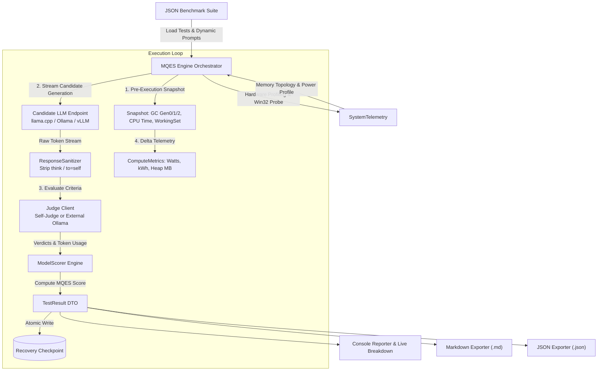

# MQES-Bench (Model Quality & Efficiency Score)

[](https://dotnet.microsoft.com/)
[](https://learn.microsoft.com/en-us/dotnet/csharp/)
[]()
[](https://opensource.org/licenses/MIT)

**MQES-Bench** is a high-performance benchmarking, profiling, and evaluation suite written in native C# 14 and .NET 10. Designed for local Large Language Models (running on `llama.cpp` / `llama-server`, `Ollama`, `vLLM`, `Unsloth`, or `LM Studio`), it evaluates model accuracy through deterministic **LLM-as-a-Judge** criteria while measuring hardware efficiency, deep CLR runtime internals, and electrical power metrics.

Unlike conventional throughput tests, **MQES-Bench neutralizes hardware advantages** (e.g., massive VRAM bandwidth or high-end GPUs) using an adaptive **Hardware Capacity Factor (HCF)**. This ensures models are judged strictly on **intrinsic architectural efficiency, token economy, and technical accuracy**.

---

## Architecture Flow



---

## The MQES Mathematical Model

Traditional LLM benchmarks suffer from hardware bias: a model executed on an RTX 4090 (1,000 GB/s VRAM) generates tokens much faster than the same model executed on a Quad-Channel DDR4 CPU (80 GB/s). **MQES-Bench solves this problem by normalizing generation throughput against an intrinsic hardware baseline.**

### 1. Hardware-Agnostic Normalized Speed ($S_{\text{norm}}$)

The measured raw generation speed ($\text{TPS}_{\text{raw}}$) is normalized by the host's **Hardware Capacity Factor ($\text{HCF}$)**:

$$S_{\text{norm}} = \frac{\text{TPS}_{\text{raw}}}{\max(\text{HCF}, 0.1)}$$

The speed multiplier ($M_{\text{speed}}$) is centered at $1.0\times$ for a standard dense 32B model baseline (2.0 t/s baseline on Quad-Channel DDR4):

$$M_{\text{speed}} = \text{clamp}\left(\frac{S_{\text{norm}}}{2.0}, 0.6, 1.4\right)$$

#### Hardware Capacity Factor (HCF) Matrix

The engine inspects physical RAM topology, active memory channels, form factor, and GPU offloading at runtime:

| Platform Topology | Detection Criteria | Baseline Memory Bandwidth | HCF Multiplier |
| :--- | :--- | :---: | :---: |
| **Desktop HEDT / Workstation** | `!IsLaptop && EstimatedDimms >= 4` (e.g., i9-7980XE, Threadripper) | ~80–85 GB/s (Quad-Channel DDR4) | **1.0x (Reference Baseline)** |
| **Laptop Hybrid GPU Offload** | `IsLaptop && GpuActiveWatts > 0` (e.g., RTX 4070 Mobile + P-Cores) | ~256 GB/s (VRAM + DDR5) | **2.5x** |
| **Desktop Standard** | `!IsLaptop && EstimatedDimms < 4` (Dual-Channel Desktop) | ~50–60 GB/s (Dual-Channel DDR4/DDR5) | **0.8x** |
| **Laptop Pure CPU** | `IsLaptop && GpuActiveWatts == 0` (Mobile CPU Execution) | ~40–50 GB/s (Mobile Dual-Channel) | **0.6x** |

### 2. Information Density & Token Economy ($E_{\text{tok}}$)

Models that produce concise, compiling code without conversational filler or bloated reasoning loops are rewarded:

$$E_{\text{tok}} = \begin{cases} 
0.85 & \text{if } T_{\text{gen}} \le 150 \quad (\text{Potentially truncated}) \\
1.15 & \text{if } 150 < T_{\text{gen}} \le 800 \quad (\text{Optimal engineering density}) \\
1.00 & \text{if } 800 < T_{\text{gen}} \le 1500 \quad (\text{Standard length}) \\
\max\left(0.70, 1.0 - \frac{T_{\text{gen}} - 1500}{4000}\right) & \text{if } T_{\text{gen}} > 1500 \quad (\text{Penalized verbosity})
\end{cases}$$

### 3. Composite MQES Formula

If the candidate model fails all criteria ($Q_{\text{judge}} = 0$), the score is strictly 0. Otherwise:

$$\text{MQES} = \text{clamp}\left( Q_{\text{judge}} \times \Big( 0.70 + 0.15 \cdot E_{\text{tok}} + 0.15 \cdot M_{\text{speed}} \Big), 0.0, 100.0 \right)$$

* **Quality Weight:** 70% (Accuracy of criteria evaluated by the Judge)
* **Information Density:** 15% (Token conciseness and absence of fluff)
* **Normalized Speed:** 15% (Intrinsic throughput advantage, e.g., MoE active parameter efficiency)

---

## Dynamic Thermal & Power Telemetry

`SystemTelemetry` estimates wall power and total energy consumption on Windows using native Win32 `kernel32.dll` APIs (`GlobalMemoryStatusEx`, `GetSystemPowerStatus`) and Registry CPU identification:

```text
                     ┌─────────────────────────────────────────────────────────┐
                     │           Instantaneous System Power (Watts)            │
                     └────────────────────────────┬────────────────────────────┘
                                                  │
          ┌──────────────────────┬────────────────┴───────────────┬──────────────────────┐
          ▼                      ▼                                ▼                      ▼
┌──────────────────┐   ┌──────────────────┐             ┌──────────────────┐   ┌──────────────────┐
│ CPU Dynamic Load │   │ Memory Channels  │             │ Active GPU Draw  │   │ Motherboard Base │
│ (Idle + Max * L) │   │ (DIMMs * W/DIMM) │             │ (Laptop Offload) │   │  (Chipset / VRM) │
└──────────────────┘   └──────────────────┘             └──────────────────┘   └──────────────────┘
          │                      │                                │                      │
          └──────────────────────┴───────────────┬────────────────┴──────────────────────┘
                                                 ▼
                               ┌──────────────────────────────────┐
                               │ Divided by PSU Efficiency (η)    │
                               └─────────────────┬────────────────┘
                                                 ▼
                               ┌──────────────────────────────────┐
                               │ Energy (kWh) = (Watts * t) / 3.6M│
                               └──────────────────────────────────┘
```

$$P_{\text{sys}} = \frac{P_{\text{cpu}} + P_{\text{ram}} + P_{\text{gpu}} + P_{\text{mobo}}}{\eta_{\text{psu}}}$$

$$\text{Energy (kWh)} = \frac{P_{\text{sys}} \times \Delta t_{\text{seconds}}}{3\,600\,000}$$

$$\text{Cost (USD)} = \text{Energy (kWh)} \times \text{Rate}_{\text{kWh}}$$

---

## Key Features

* **Universal Backend Support:** Works with any OpenAI-compatible API endpoint (`llama-server`, `Ollama`, `vLLM`, `Unsloth`, `LM Studio`).
* **Decoupled LLM-as-a-Judge:** Run the benchmarked model locally (e.g., via `llama-server` on GPU/CPU) while pointing the Judge to an external model (e.g., `llama3.1:70b` on Ollama or remote vLLM). Supports automatic **Self-Judge** fallback.
* **Deep CLR & Win32 Telemetry:** Measures Managed Heap (`ManagedHeapMb`), Process Working Set (`ProcessWorkingSetMb`), OS physical RAM load, and Garbage Collector deltas (`Gen 0`, `Gen 1`, `Gen 2`) per test.
* **Token Reasoning Sanitization:** Detects and strips reasoning monologues (`<think>...</think>`, `to=self` headers), rescuing partial markdown code fences on token truncation.
* **Criteria Pass Rate Analytics:** Ranks and exports the **Top 5 Most Failed Criteria** and **Top 5 Most Consistently Passed Criteria** across the entire test run.
* **Checkpoint Persistence & Resumption:** Automatically persists progress to `benchmark_checkpoint.json` after every single test. Resume interrupted suites with `mqes-bench -r`.

---

## Project Structure

```text
MQES-Bench/
├── Models/
│   ├── BenchmarkSuite.cs          # Test suites, criteria, and prompt DTOs
│   ├── ServerMetadata.cs          # Model name, quantization, and context limits
│   └── TestResult.cs              # Granular per-test results and metrics
├── Scoring/
│   └── ModelScorer.cs             # MQES and Hardware-Agnostic speed normalization
├── Services/
│   ├── CheckpointManager.cs       # Atomic JSON checkpoint persistence
│   ├── EvaluationJudge.cs         # Deterministic LLM-as-a-Judge validation engine
│   ├── ResponseSanitizer.cs       # Reasoning token filter (<think>, to=self, EOT)
│   ├── ServerProbe.cs             # Auto-prober for /v1/models and /props
│   └── SuiteManager.cs            # JSON suite parser and numeric index range resolver
├── Reporting/
│   ├── ConsoleReporter.cs         # UTF-8 console dashboard, histograms, criteria ranking
│   ├── JsonExporter.cs            # Structured machine-readable export (.json)
│   ├── MarkdownExporter.cs        # Comprehensive evaluation report (.md)
│   └── MathStats.cs               # Percentiles, StdDev, Coefficient of Variation (CV%)
├── SystemTelemetry.cs             # Win32 P/Invoke, CLR GC polling, power & thermal model
├── InferenceConfigurator.cs       # Auto-tuning sampling profiles (Coder, Architect, etc.)
└── Program.cs                     # CLI entry point and streaming orchestration loop
```

---

## CLI Options & Usage

```text
Usage syntax:
  mqes-bench [suite.json] [options]
```

### General & Filtering Options

| Flag | Long Flag | Description | Default |
| :--- | :--- | :--- | :--- |
| `-f` | `--file <path>` | Path to test suite JSON file | `benchmark_suite.json` |
| `-c` | `--category <cats>` | Filter by exact category match (comma-separated) | `ALL` |
| `-cc` | `--category-contains <term>` | Substring search on Category or Test Name | None |
| `-n` | `--numbers <range>` | Run specific 1-based indices or ranges (e.g., `1,3,5`, `3-5`, `10-`, `-5`) | All |
| `-r` | `--resume` | Resume execution from last saved checkpoint file | `false` |
| `-l` | `--list` | List available categories in suite and exit | `false` |
| `-ck` | `--cost-kwh <rate>` | Electricity price per kWh in USD for power telemetry | `$0.15` |
| `-h` | `--help` | Show CLI help message and exit | — |

### Candidate Generator Options

| Flag | Long Flag | Description | Default |
| :--- | :--- | :--- | :--- |
| `-e` | `--endpoint <url>` | Generator OpenAI-compatible endpoint URL | `http://localhost:8080/v1` |
| `-m` | `--model <name>` | Candidate model identifier (auto-detected if omitted) | Auto-detected |
| `-ak` | `--api-key <key>` | API key for generator endpoint | `not-needed` / `LLM_API_KEY` |
| `-t` | `--timeout <sec>` | Network timeout for candidate generation per test | `1800` (30 min) |
| `-k` | `--tokens <num>` | Maximum output token generation limit per test | Auto-tuned |
| `--temp` | `--temperature <val>` | Sampling temperature override | Auto-tuned |
| `--top-p` | `--top-p <val>` | Top-P nucleus sampling override | Auto-tuned |

### Judge & Evaluation Options

| Flag | Long Flag | Description | Default |
| :--- | :--- | :--- | :--- |
| `-nj` | `--no-judge` | Throughput-only mode (t/s, TTFT, tokens) without criteria judge | `false` |
| `-je` | `--judge-endpoint <url>` | Dedicated endpoint URL for the Judge (e.g., Ollama, vLLM) | Inherits generator URL |
| `-jm` | `--judge-model <name>` | Dedicated model name for the Judge | Inherits generator model |
| `-jk` | `--judge-key <key>` | API key for Judge endpoint | Inherits generator key |
| `-jt` | `--judge-timeout <sec>` | Dedicated timeout for Judge evaluations | Matches generator timeout |

---

## Practical Examples

### 1. Self-Evaluation on Local `llama-server`
```bash
mqes-bench benchmark_sql_suite.json
```

### 2. Evaluating Ollama Model with Local Self-Judge
```bash
mqes-bench benchmark_csharp_net10_suite.json -e http://localhost:11434/v1 -m qwen2.5-coder:32b
```

### 3. High-Throughput Generator (vLLM / Unsloth) with Heavy External Judge (Ollama 70B)
```bash
mqes-bench benchmark_csharp_net10_suite.json \
  -e http://localhost:8000/v1 -m unsloth/Qwen3-Coder-30B-A3B-Instruct \
  -je http://localhost:11434/v1 -jm llama3.1:70b \
  -t 300 -jt 180
```

### 4. Throughput and Power Telemetry Only (No Judge Pass)
```bash
mqes-bench benchmark_memory_performance_suite.json -nj -ck 0.18
```

### 5. Running Specific Test Ranges & Categories
```bash
mqes-bench benchmark_webapi_architecture_suite.json -c "Architecture & DI" -n 1-3
```

---

## Modular Benchmark Suites

The repository includes 6 domain-specific test suites, each equipped with tuned system prompts and evaluation guidelines:

| Suite File | Primary Topics & Focus Areas |
| :--- | :--- |
| **`benchmark_sql_suite.json`** | T-SQL, Sargability, Index Seeks, Locking Hints (`UPDLOCK`, `HOLDLOCK`), Dapper type conversion, EF Core `ExecuteUpdateAsync` |
| **`benchmark_csharp_net10_suite.json`** | C# 14 contextual `field`, Extension Blocks, `allows ref struct`, `OrderedDictionary`, `Tensor<T>`, `Lock`, Pattern Matching |
| **`benchmark_concurrency_async_suite.json`** | `Parallel.ForEachAsync`, `IAsyncEnumerable`, ThreadPool starvation, `System.Threading.Channels`, `ValueTask` rules |
| **`benchmark_memory_performance_suite.json`** | `ReadOnlySpan<char>`, `ArrayPool<T>`, `RecyclableMemoryStream`, `System.IO.Pipelines`, `stackalloc`, GC Gen 0/1/2 |
| **`benchmark_webapi_architecture_suite.json`** | Minimal APIs, Captive Dependencies, Middleware pipeline order, `HybridCache`, gRPC streaming, Native Rate Limiting |
| **`benchmark_ui_blazor_maui_suite.json`** | Blazor Static SSR `[StreamRendering]`, `EventCallback` dispatcher, .NET MAUI `MainThread`, Native Handler leaks |

---

## Sample Console Output

```text
================================================================================
  MQES-Bench: Model Quality & Efficiency Evaluator (.NET 10 / C# 14)
================================================================================
  Host System   : LENOVO (Laptop / Mobile)
  CPU Model     : 13th Gen Intel(R) Core(TM) i9-13900HX (32 Logical Cores)
  RAM Topology  : 63.7 GB Total (~4 DIMMs @ Max 14W) - 48% loaded
  System RAM    : 30.8 GB in use / 63.7 GB Total (48% loaded)
  CLR Runtime   : .NET 10.0.11 (GC: Workstation GC)
--------------------------------------------------------------------------------
  Suite File    : benchmark_csharp_net10_suite.json (C# 14 & .NET 10 Suite)
  Generator URL : http://localhost:8080/v1 [Model: Qwen3-Coder-30B-A3B-UD-Q8]
  Judge Config  : http://localhost:11434/v1 [Model: qwen2.5-coder:32b] (External Judge)
  Capacity Fact : 2.50x baseline multiplier
  Power Profile : TDP Max: 65W | Mult: 1.15x | PSU: 92%
  Context Size  : 32,768 tokens | Max Output: 2,000 tokens
  Sampler Auto  : Temp: 0.20 | TopP: 0.90 | Strategy: Deterministic Coder Profile
  Power Rate    : $0.15 USD / kWh
  Mode          : Full Criteria Evaluation (MQES Enabled)
  Started At    : 2026-08-24 14:10:00
================================================================================

 --> Running test 1 of 12: [.NET 10 & C# 14] .NET 10: Contextual 'field' Keyword in Properties...
    [1/12] Quality: 100/100 pts -> MQES: 98.5/100 | Speed: 24.8 t/s (Norm: 9.9 t/s) | TTFT: 112 ms | Time: 7.2s (Gen: 4.8s | Judge: 2.4s)
    └─ [Resources] CPU: 14.2% | RAM (WS): 84.2 MB (Heap: 4.1 MB) | Sys: 31.2/63.7 GB | GC Gen0/1/2: 1/0/0 | Power: 82 W | Energy: 0.16 Wh ($0.0000)

═══════════════════════════════════════════════════════════════════════════════════════════════
   BENCHMARK REPORT - ADVANCED METRICS & CLR INTERNALS
═══════════════════════════════════════════════════════════════════════════════════════════════

┌─ QUALITY & MODEL EFFICIENCY SCORE (MQES) ──────────────────────────────────
│ Global MQES Score     : 96.4 / 100 pts  (Median: 98.2 | P95: 99.4 | StdDev: ±3.82)
│ Judge Quality Avg     : 97.9 / 100 pts  (Median: 100.0 | StdDev: ±2.45 pts)
│ Normalized Speed (TPS): 9.85 t/s baseline (Hardware-Agnostic)
│ PASS (100%):  11 (92%)  │  PARTIAL:   1 (8%)  │  FAIL (0%):   0 (0%)
└──────────────────────────────────────────────────────────────────────────────

┌─ PERFORMANCE (LATENCY, TIMING & THROUGHPUT) ────────────────────────────────
│ Total Tokens Generated : 6,420 (Gen: 4,820 | Judge: 1,600)
│ Total Active Time      : 00:01:24 (Gen: 00:00:58 | Judge: 00:00:26)
│ Avg Time per Test      : 7.0s (Gen: 4.8s | Judge: 2.2s)
│ Global Throughput      : 8.57 req/min  (76.4 tok/s global)
│
│ ╭─ Generation Speed (tokens/s) ───────────────────────────────────────────────
│ │  Avg: 24.62 t/s  │  Median: 24.80 t/s
│ │  P95: 26.10 t/s  │  P99: 26.40 t/s  │  StdDev: 1.15 t/s  │  CV: 4.7% (consistency)
│ ╰─────────────────────────────────────────────────────────────────────────────
└──────────────────────────────────────────────────────────────────────────────

┌─ CATEGORY BREAKDOWN ──────────────────────────────────────────────────────────────────────────
│ Category                                   Tests   Avg Q    MQES   Med t/s  Norm t/s  Pass  Fail
├───────────────────────────────────────────────────────────────────────────────────────────────
│ .NET 10 & C# 14                                5   100.0    98.5      25.1       10.0     5     0
│ .NET 10 & C# 14 - Data Types & Keywords        4   100.0    97.8      24.6        9.8     4     0
│ Pattern Matching Advanced                      2    95.0    93.2      24.0        9.6     1     0
│ Migration                                      1    90.0    88.5      23.8        9.5     1     0
└───────────────────────────────────────────────────────────────────────────────────────────────

┌─ TOP 5 MOST CONSISTENTLY PASSED CRITERIA ──────────────────────────────────────────────────
│ 100.0% (12/12)  ████████████████████  Contextual 'field' keyword accesses compiler backing field
│ 100.0% (12/12)  ████████████████████  System.Threading.Lock integration with lock statement
│ 100.0% (12/12)  ████████████████████  Span<T> implicit conversion avoids explicit AsSpan()
└──────────────────────────────────────────────────────────────────────────────────────────────
```

---

## JSON Suite Schema Specification

Each suite file accepts global prompt configurations and an array of test cases with weighted criteria:

```json
{
  "Name": "Suite Display Name",
  "DefaultSystemPrompt": "You are a Principal Engineer...",
  "DefaultUserPromptSuffix": "MANDATORY OUTPUT CONSTRAINTS:\n1. Wrap code in ```csharp ... ``` blocks.",
  "DefaultJudgeSystemPrompt": "You are a strict technical evaluation judge...",
  "Tests": [
    {
      "Name": "Test Identifier",
      "Category": "Category Name",
      "Prompt": "Technical challenge or code refactoring task...",
      "SystemPrompt": null,
      "UserPromptSuffix": null,
      "JudgeSystemPrompt": null,
      "Criteria": [
        {
          "Description": "Exact architectural or syntactic requirement to be verified by the Judge",
          "Weight": 50
        },
        {
          "Description": "Second requirement to verify",
          "Weight": 50
        }
      ]
    }
  ]
}
```

---

## Building and Publishing

```bash
# Clone the repository
git clone [https://github.com/cd33178/MQES-Bench.git](https://github.com/cd33178/MQES-Bench.git)
cd MQES-Bench

# Build Release binary targeting .NET 10
dotnet build -c Release

# Publish as a self-contained single-file executable for Windows x64
dotnet publish -c Release -r win-x64 --self-contained -p:PublishSingleFile=true -o ./publish
```
